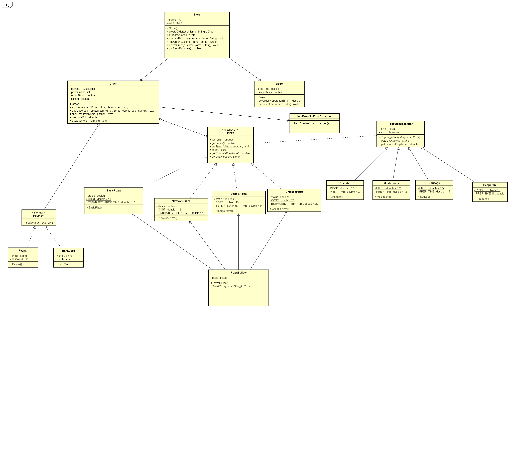

## **Pizza System** 

Student: Solomon Asezebhobor and Ademola Adigun

## **About the Pizza System**

 The pizza system is made up of 18 classes and its purpose is serve as a system to be used by a pizza store to
 be able to do the followings:

- Creating pizzas  

- Decorating pizza with toppings of the users choice

- Keep tracks of customer orders

- Prepare the orders

- Provide payment option per order

  

  ## **Which patterns are used**

- Factory for building the pizza

- Strategy for the payment system

- Observer for setting the pizza order status after Oven is done preparing Orders

- Decorator for add toppings to the pizza

Class diagram

